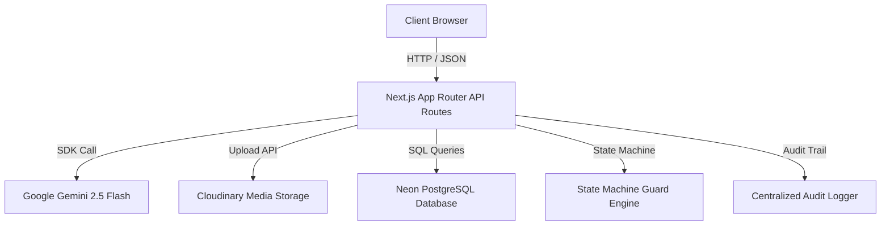
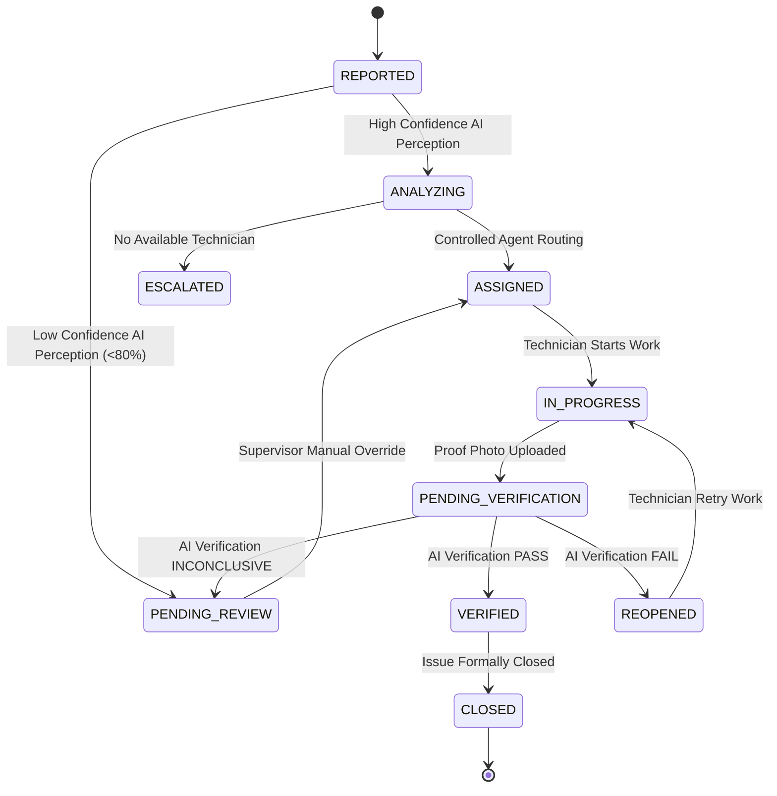
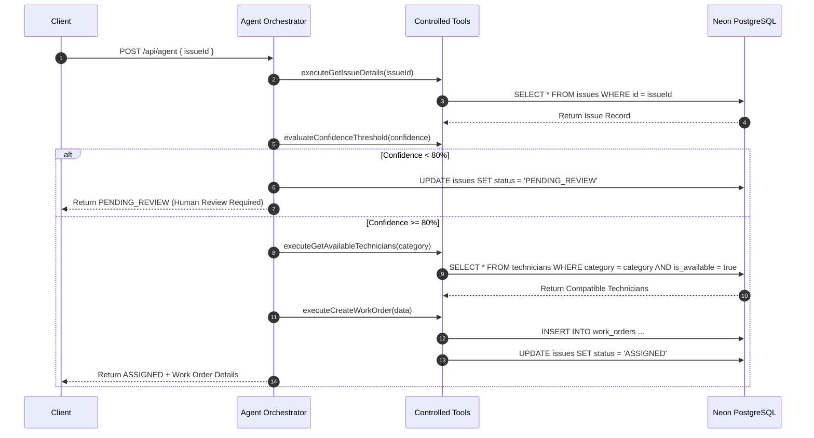
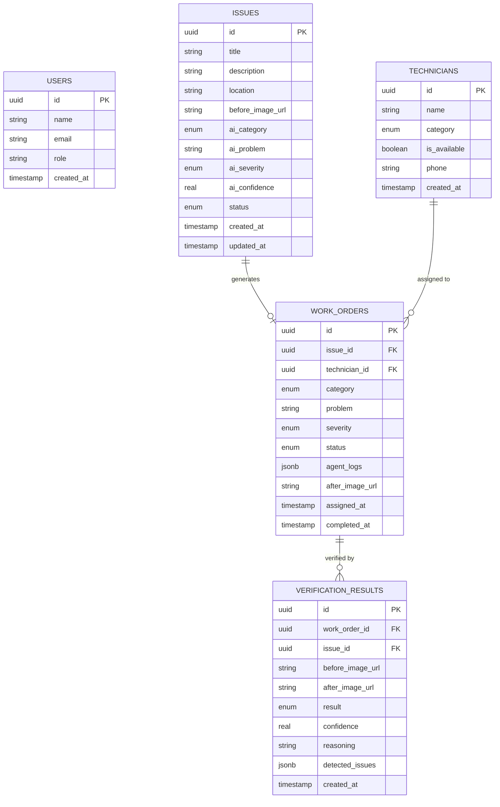

# FixProof AI — Technical Architecture Specification

## 1. System Overview

FixProof AI is built as a closed-loop, proof-verified facility maintenance management application. The architecture combines Next.js 16 App Router, React 19, Neon PostgreSQL, Drizzle ORM, Google Gemini 2.5 Flash, and Cloudinary media storage.



---

## 2. Frontend Architecture

- **Framework**: Next.js 16.3.2 (App Router with Turbopack) & React 19.
- **Styling & Aesthetics**: Tailwind CSS v4, custom glassmorphism design system (`glass-panel`), HSL slate/indigo/cyan palette, and Lucide React icons.
- **Page Routes**:
  - `/`: Product Landing Showcase & Evaluator Role Selector.
  - `/supervisor`: Supervisor Operations Dashboard & Operational Risk Matrix.
  - `/issues`: Filterable Issue Management Queue.
  - `/issues/[id]`: Flagship Issue Command Center.
  - `/technician`: Mobile-optimized Field Technician Portal.
  - `/report`: 3-step AI-assisted Incident Intake Form.
  - `/evaluation`: Redirects to Supervisor Console (Internal benchmark runner accessible via `/api/evaluation`).

---

## 3. State Machine Engine (`lib/agent/stateMachine.ts`)

The status lifecycle of an issue is governed by a deterministic state machine:



---

## 4. Agent Orchestration Architecture (`lib/agent/orchestrator.ts`)

The AI Agent does NOT execute raw SQL or mutate database records directly. Instead, it operates through **Controlled Tools**:

1. **`executeGetIssueDetails`**: Reads issue metadata, category, severity, and confidence score.
2. **`evaluateConfidenceThreshold`**: Evaluates `confidence >= 0.80`. If false, transitions issue to `PENDING_REVIEW` and halts routing.
3. **`executeGetAvailableTechnicians`**: Queries available technicians matching the exact category (`plumbing` $\rightarrow$ Plumber).
4. **`selectTechnicianStrategy`**: Matches a compatible technician deterministically.
5. **`executeCreateWorkOrder`**: Creates the work order record in Neon DB and updates issue status to `ASSIGNED`.



---

## 5. Multimodal AI Perception & Verification Architecture

### Stage 1 — AI Perception (`lib/ai/perception.ts`)
- **Input**: Scene photograph (base64 or URL) + optional text description.
- **Model**: `gemini-2.5-flash` via `@google/genai`.
- **System Instructions**: Evaluates physical defect features, classifies category (`plumbing`, `electrical`, `cleaning`), assigns severity (`low`, `medium`, `high`, `critical`), and outputs confidence score ($0.0 - 1.0$).

### Stage 2 — 2nd-Stage Repair Verification (`lib/ai/verification.ts`)
- **Input**: Dual image payload — `BEFORE_IMAGE` (original reported issue) and `AFTER_IMAGE` (technician proof photo).
- **Model**: `gemini-2.5-flash`.
- **System Prompt**: Performs side-by-side visual comparison to assess whether the original defect has been physically resolved.
- **Output**:
  - `PASS`: Problem completely resolved. Status $\rightarrow$ `VERIFIED` $\rightarrow$ `CLOSED`.
  - `FAIL`: Defect remains visible. Status $\rightarrow$ `REOPENED` (technician retry loop).
  - `INCONCLUSIVE`: Image dark/blurry. Status $\rightarrow$ `PENDING_REVIEW` (supervisor intervention).

---

## 6. Operational Risk Calculator (`lib/operationalRisk.ts`)

Computes real-time operational risk levels based on severity, status, and AI confidence:

| Risk Level | Condition Criteria | UI Badge Style |
| :--- | :--- | :--- |
| **`CRITICAL`** | Critical severity OR Reopened repair OR Escalated issue | `bg-rose-950 text-rose-300 border-rose-600` |
| **`HIGH`** | High severity OR Low AI confidence ($<80\%$) OR Pending Review | `bg-amber-950 text-amber-300 border-amber-600` |
| **`MEDIUM`** | Medium severity OR In Progress repair | `bg-blue-950 text-blue-300 border-blue-600` |
| **`LOW`** | Low severity OR Closed/Verified status | `bg-slate-900 text-slate-300 border-slate-700` |

---

## 7. Database Architecture (`drizzle/schema.ts`)



---

## 8. Audit Architecture (`lib/audit/logger.ts`)

Every significant operation emits a structured audit record:

```typescript
export interface AuditEventInput {
  issueId: string;
  workOrderId?: string;
  technicianId?: string;
  eventType: string;
  previousStatus?: string;
  newStatus?: string;
  actorType: 'SYSTEM' | 'AI_AGENT' | 'TECHNICIAN' | 'SUPERVISOR';
  actorName?: string;
  details: string;
  success?: boolean;
  correlationId?: string;
}
```

Audit logs are stored persistently in memory and database stores, generating a request correlation ID (`req_<timestamp>`) for end-to-end tracing.

---

## 9. Security & Error Sanitization (`lib/errors.ts`)

- **Credential Isolation**: Secrets (`DATABASE_URL`, `GEMINI_API_KEY`, `CLOUDINARY_API_SECRET`) are accessible strictly on the server-side.
- **Client Error Sanitization**: Internal stack traces, raw Gemini 500 errors, Neon database connection errors, and Cloudinary secrets are caught by `sanitizeServerError()` and converted into safe user-facing toast/banner messages.

---

## 10. Deployment Architecture

- **Hosting**: Vercel (Next.js App Router Edge/Node runtime).
- **Database**: Neon Serverless PostgreSQL (`@neondatabase/serverless` HTTP connection).
- **Media CDN**: Cloudinary Media Storage for before/after evidence assets.
